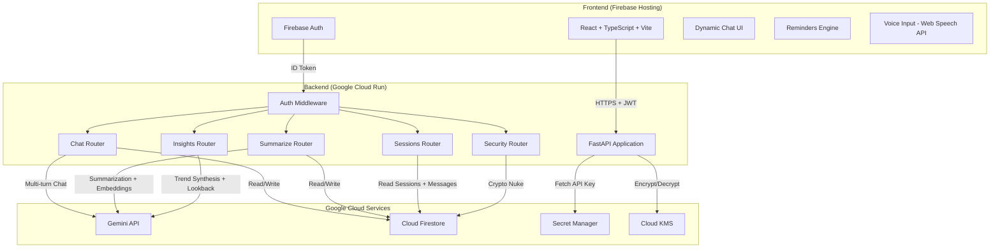
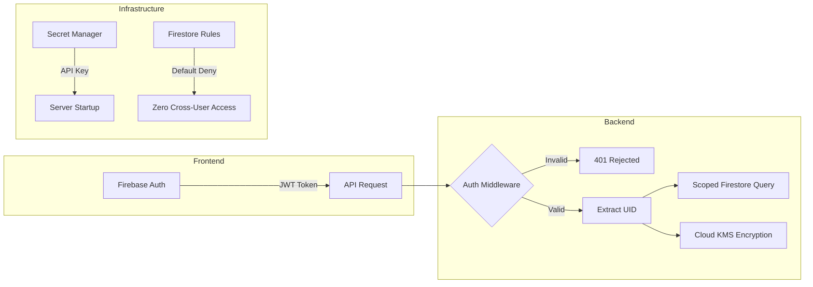

# GemScribe

**A production-grade, AI-powered private journaling platform built on Google Cloud.**

> Your thoughts, encrypted. Your growth, visualized. Your data, yours alone.

[Live Demo](https://darshanideathon.web.app)

---

## The Problem

Most AI-powered apps look great in a demo but fall apart in production. Hardcoded API keys, no authentication boundaries, shared databases with zero user isolation. GemScribe was built from the ground up to solve exactly this. Every architectural decision prioritizes security, data isolation, and production readiness while delivering a genuinely useful AI journaling experience.

---

## Architecture



---

## How It Works

```
User signs in via Firebase Auth (Google OAuth)
        |
        v
JWT token is sent with every API request
        |
        v
FastAPI backend validates the token server-side
        |
        v
API key is fetched from Google Secret Manager (never hardcoded)
        |
        v
Gemini processes the journal entry with the selected Persona
        |
        v
Response + mood + stress data stored in user-isolated Firestore documents
        |
        v
Summaries encrypted at rest using Cloud KMS AES-256-GCM
        |
        v
Searchable, filterable, favoritable journal entries with full radar analytics
```

---

## Core Features

### User Authentication
Firebase Authentication with Google OAuth. Every API request is validated server-side by decoding the Firebase JWT and extracting the user ID. No anonymous access is possible.

### Multi-turn AI Conversations
Real-time conversations with the Gemini API. The backend maintains conversation history (capped at a configurable number of turns) and sends the full context window to Gemini on each request, enabling coherent multi-turn dialogue.

### Isolated Data Storage
Every piece of data in Firestore lives under a path scoped to the authenticated user's UID:
```
users/{uid}/sessions/{sessionId}/messages/{messageId}
users/{uid}/summaries/{summaryId}
```
Firestore Security Rules enforce a default-deny policy. No user can read or write another user's data, period.

### Secure Key Management
The Gemini API key is stored in Google Cloud Secret Manager and fetched at server startup. It is never committed to source code, never exposed to the frontend, and never hardcoded in environment variables on the container.

---

## Feature Enhancements (Beyond Base Spec)

### Socratic Persona Switcher
Four distinct AI personas that fundamentally change how Gemini responds to your journal entries:
| Persona | Behavior |
|---|---|
| Empathic Listener | Supportive, reflective journaling companion |
| Socratic Coach | Challenges assumptions with probing questions |
| Devil's Advocate | Critiques ideas, surfaces blind spots and risks |
| Executive Summarizer | Bullet points, action items, zero fluff |

Each persona injects a completely different system instruction into the Gemini API call, transforming the model's behavior at the prompt level.

### Per-Chat Summary & Emotional Radar
Click the notebook icon on any chat to instantly generate a structured summary of that conversation, powered by Gemini. Each summary includes:
- A concise overview of the conversation
- The dominant mood detected across the session
- Up to three auto-generated topic tags
- A live **Radar Chart** (Recharts) that visualizes the exact emotional distribution for that specific chat session, built from the per-message mood data stored in Firestore

This works on both the active chat and any previously saved session loaded from the sidebar.

### Favorites System
Star any journal summary to mark it as a favorite. Favorites are persisted in Firestore and can be filtered instantly via a dedicated toggle in the Entries tab. Optimistic UI updates ensure the star appears immediately while the backend syncs in the background.

### Full-Text Search, Tag Filtering & Date Filtering
The Entries tab provides a complete journal management experience:
- **Keyword Search:** Instantly filter entries by searching across summaries, tags, and mood labels
- **Tag Filtering:** Click any tag pill to filter all entries by that specific topic
- **Date Picker:** Select a specific calendar date to view only entries from that day
- **Favorites Toggle:** Show only your starred entries with a single click

All filters are composable and work together in real time.

### Native Reminders & Timer System
Type "remind me in X minutes" (or hours) in the chat, and the app will:
1. Parse the time duration from your natural language message using regex
2. Register a native browser notification timer for the exact duration
3. Add the reminder to the always-visible **Reminders Hub** (top-right bell icon)
4. Fire a real desktop notification when the timer expires

Reminders persist across the session via `localStorage`. You can view, edit, or delete any active reminder from the Hub, or type "remove reminder" in the chat to clear them all. The AI is instructed to acknowledge the reminder instead of claiming it cannot set timers.

### AI Insights Hub
An analytics dashboard that aggregates your emotional data across all sessions:
- **Cognitive Mood Radar:** A live radar chart rendered with Recharts showing your overall emotional distribution across all journal entries
- **Weekly Synthesis:** Sends your concise session summaries (never raw chat logs) to Gemini to synthesize high-level growth advice and identify recurring emotional patterns
- **Lookback Queries:** Ask natural-language questions about your journal history (e.g., "What patterns do you see in my stress levels?") and Gemini answers using your summaries as context

### Real-time Mood & Stress Tracking
Every Gemini response includes a structured JSON block with a single-word mood label and a 1-10 stress score. This data is:
- Persisted alongside every message in Firestore (including `mood` and `stress_level` fields)
- Returned when loading historical sessions so radar charts render accurately on past chats
- Aggregated in the Insights Hub for cross-session trend analysis

### Voice-to-Text Input
Integrated speech recognition via the Web Speech API. Click the microphone icon to dictate journal entries hands-free. Supported in Chrome and Edge.

### Cloud KMS Encryption
All session summaries are encrypted at rest using Google Cloud KMS with AES-256-GCM symmetric encryption. The encryption and decryption operations happen entirely server-side through the KMS API. Raw summaries are never stored in Firestore — only ciphertext.

### Crypto Nuke Protocol
A one-click data destruction pipeline. When triggered, the backend systematically walks through the authenticated user's entire Firestore document tree (sessions, messages, summaries, profile) and permanently deletes every record. Irreversible by design.

### Dynamic Chat Interface
A dynamically resizing chat input that grows with your message, integrated persona switching via a drop-up menu, message action buttons (copy, like, dislike, regenerate, share), and a polished onboarding Welcome Modal with a 2-column feature grid.

### Clean Response Formatting
The Gemini system prompt is explicitly configured to avoid markdown bolding (asterisks) in responses. Lists use clean bullet points for a natural, readable journaling experience instead of cluttered formatting artifacts.

---

## Tech Stack

| Layer | Technology |
|---|---|
| Frontend | React 19, TypeScript, Vite, Recharts |
| Styling | Tailwind CSS 4, Custom Apple-style Design System |
| Auth | Firebase Authentication (Google OAuth) |
| Hosting | Firebase Hosting |
| Backend | Python 3.12, FastAPI, Uvicorn |
| Deployment | Google Cloud Run (containerized via Dockerfile) |
| AI | Gemini API (gemini-3.6-flash) |
| Embeddings | Gemini Embedding API (gemini-embedding-001) |
| Database | Google Cloud Firestore |
| Secrets | Google Cloud Secret Manager |
| Encryption | Google Cloud KMS (AES-256-GCM) |
| Voice | Web Speech API (browser-native) |
| Notifications | Web Notifications API (browser-native) |

---

## Project Structure

```
googleideathon/
├── backend/
│   ├── main.py                 # FastAPI app, CORS, middleware, lifespan
│   ├── auth.py                 # Firebase JWT validation
│   ├── config.py               # Environment config (project ID, KMS paths)
│   ├── encryption.py           # Cloud KMS encrypt/decrypt operations
│   ├── firestore_client.py     # Firestore CRUD + user data deletion
│   ├── gemini_client.py        # Gemini API wrapper (chat, summarize, embed, insights)
│   ├── secret_manager.py       # Secret Manager key retrieval
│   ├── models.py               # Pydantic request/response models
│   ├── routers/
│   │   ├── chat.py             # POST /api/chat
│   │   ├── sessions.py         # GET /api/sessions, GET /api/sessions/{id}/messages
│   │   ├── summarize.py        # POST /api/summarize, GET /api/summaries, PATCH favorites
│   │   ├── insights.py         # POST /api/insights/synthesize-trends, POST /api/lookback
│   │   └── security.py         # DELETE /api/security/crypto-nuke
│   ├── Dockerfile
│   └── requirements.txt
├── frontend/
│   ├── src/
│   │   ├── pages/
│   │   │   ├── LoginPage.tsx
│   │   │   └── JournalPage.tsx   # Main app (~1200 lines: chat, entries, insights, modals)
│   │   ├── components/
│   │   │   ├── WelcomeModal.tsx   # Onboarding modal with 2-column feature grid
│   │   │   └── ui/
│   │   │       └── chat-input.tsx # Auto-resizing input with voice + persona switcher
│   │   ├── contexts/
│   │   │   └── AuthContext.tsx
│   │   ├── lib/
│   │   │   └── api.ts            # Typed API client (all backend endpoints)
│   │   ├── index.css             # Custom design tokens + Apple-style system
│   │   ├── App.tsx
│   │   └── main.tsx
│   ├── package.json
│   └── vite.config.ts
├── firestore.rules
├── firebase.json
└── DESIGN.md
```

---

## Security Model



**Key security properties:**
- Default-deny Firestore rules. All access is blocked unless explicitly allowed for the authenticated UID.
- Server-side JWT validation on every request. The frontend never touches raw API keys.
- API keys live in Secret Manager, fetched once at container startup.
- Encryption at rest via Cloud KMS. The backend never stores raw encryption keys locally.
- CORS restricted to the exact frontend origins only.
- Request logging middleware captures every inbound request for audit trails.
- Summaries stored as ciphertext in Firestore, decrypted only on authenticated retrieval.

---

## Local Development

### Prerequisites
- Node.js 18+
- Python 3.12+
- Google Cloud project with Firestore, Secret Manager, and KMS configured
- Firebase project with Authentication enabled

### Backend
```bash
cd backend
pip install -r requirements.txt
uvicorn backend.main:app --host 0.0.0.0 --port 8000 --reload
```

### Frontend
```bash
cd frontend
npm install
npm run dev
```

---

## Deployment

### Backend (Cloud Run)
```bash
cd backend
gcloud run deploy gemini-journal-api --source . --region asia-south1 --allow-unauthenticated
```

### Frontend (Firebase Hosting)
```bash
cd frontend
npm run build
cd ..
firebase deploy --only hosting
```

---

## Live

The application is fully deployed and running in production.

**Frontend:** [https://darshanideathon.web.app](https://darshanideathon.web.app)

**Backend:** Google Cloud Run (asia-south1)

---

Built for the Google Cloud Gen AI Academy APAC Edition, Cohort 3.
